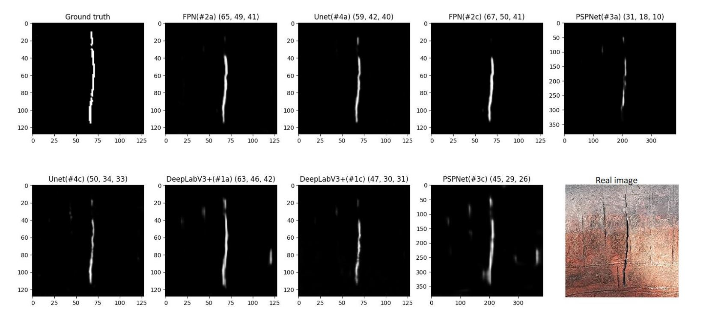

# Masonry Surface Crack Detection using Deep Learning

## Introduction
Detecting cracks on masonry surfaces, especially on rough surfaces like masonry, is a challenging task. This repository presents a deep learning-based approach for the detection of surface cracks on masonry surfaces. The research focuses on comparing the performance of various deep learning architectures for the semantic segmentation of cracks on masonry surfaces.

## Abstract
This research paper introduces an innovative method for the automatic detection of surface cracks on masonry using deep learning techniques. The study evaluates the effectiveness of several popular segmentation models, including U-Net, FPN (Feature Pyramid Network), DeepLabV3+, and PSPNet (Pyramid Scene Parsing Network) integrated with different Convolutional Neural Networks (CNNs) acting as the backbone. Additionally, two distinct loss functions, binary cross entropy and binary focal loss, are employed in the experiments.

The performance of the models is compared using key metrics, such as the Dice coefficient, Intersection over Union (IoU), and F1 score. A total of 23 network configurations are evaluated on both training and validation datasets of masonry images. The results demonstrate that three networks stand out, showing promising accuracy in detecting surface cracks on masonry surfaces. These networks are identified as FPN (Dice: 86.9%, IoU: 74.9%, F1 score: 59.3%), FPN (Dice: 85.6%, IoU: 75.4%, F1 score: 56.3%), and DeepLabV3+ (Dice: 83.1%, IoU: 72.0%, F1 score: 54.4%).

Furthermore, the trained networks have exhibited impressive performance when applied to existing masonry culverts. This study's findings can play a significant role in detecting cracks in the masonry substructure of old railway bridges, contributing to structural health monitoring and maintenance.

## Repository Structure
The repository is organized into the following directories:
- `data_preprocessing`: Contains code for data preprocessing, including image resizing and normalization.
- `model_definitions`: Includes model architecture definitions for U-Net, FPN, PSPNet, DeepLabV3+, and other related functions.
- `losses`: Contains custom loss functions, including binary focal loss.
- `model_train`: Code for training the deep learning models using the prepared data.
- `evaluation_metrics`: Custom evaluation metrics such as dice coefficient, IoU, F1 score, etc.
- `project_main`: An integration of all the project components to streamline the process.

## Getting Started
1. Clone this repository: `git clone https://github.com/Pranjal-bisht/Crack_segmentation_using_deep_learning_techniques.git`
2. Navigate to the cloned repository: `cd Crack_segmentation_using_deep_learning_techniques`
3. Install the required dependencies: `pip install -r requirements.txt`
4. Explore the different directories to understand the project structure and code components.
5. Run the desired scripts to preprocess data, define models, train models, and evaluate results.

## Acknowledgments
This research project was conducted as part of a study aimed at advancing the field of masonry surface crack detection. We acknowledge the support of the research community and the availability of open-source deep learning libraries that have contributed to the success of this project.

---

This README.md provides an overview of the masonry surface crack detection project, including a brief introduction, the abstract from the research paper, the repository structure, instructions for getting started, acknowledgments, and licensing information.
